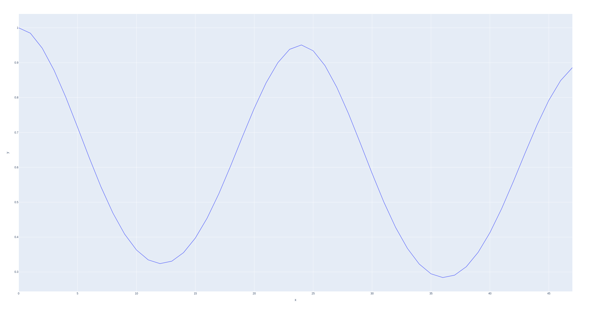

# Project Popsickle
Project popsickle aims to compare different time analysis techniques and assess their efficacy when forecasting power draw data. Multivariate techniques will be able to use weather in major cities as an extra predictor.

## Run
```
pip -r requirements.txt
make insert
```

## Pipeline
There are two main datasets that this project uses: the power draw dataset and the weather dataset.

The power draw dataset is taken directly from ERCOT's website as Excel files. From there, it is read, concatenated, cleaned, and put into our intermediate data storage, a SQLit3 database.

The weather dataset is gathered from Open Metos's API using OpenWeatherMap's Geocoding API .From there, it undergoes a process similar to the power draw data, and is put into our intermediate data storage, a SQLit3 database.

## Structure
 - https://github.com/dssg/hitchhikers-guide/tree/master/sources/curriculum/0_before_you_start/pipelines-and-project-workflow

## APIs
 - https://open-meteo.com/en/docs/historical-weather-api#latitude=32.78&longitude=-96.81&start_date=2002-01-01&end_date=2022-12-31&hourly=temperature_2m
 - https://openweathermap.org/api/geocoding-api

## ERCOT Regions


[Link](https://www.ercot.com/files/assets/2022/12/13/ERCOT-Maps_Weather.jpg?)

## Testing
### Stationarity
Stationarity is important because other models (eg. Moving Average) rely on it. 

The 3 conditions for stationarity are:
 - $\mu$ is constant
 - $\sigma$ is constant
 - There is no seasonality

From a visual inspection, it seems that while $\mu$ and $\sigma$ are constant, the power data shows seasonality.

This is further supported by an autocorrelation plot where we see a high autocorrelation every 24 hours.


