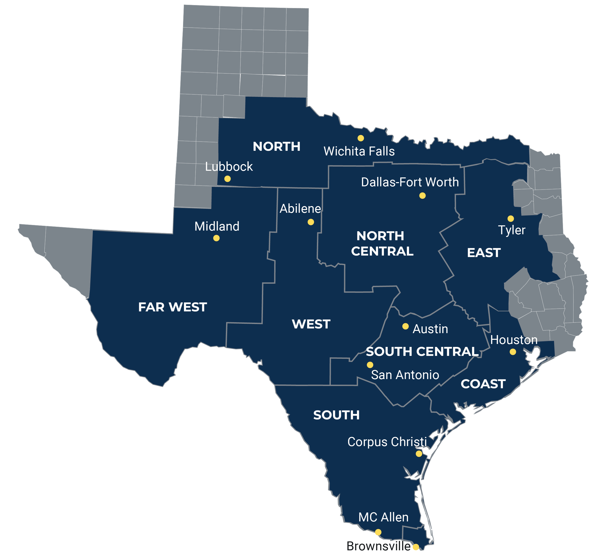

# Project Popsickle

## ERCOT Regions

[Link](https://www.ercot.com/files/assets/2022/12/13/ERCOT-Maps_Weather.jpg?)

### Key Cities in Each Region
1. North
    - Lubbock
    - Wichita Falls
2. Far West
    - Midland
3. West
    - Abilene
4. South
    - Corpus Christi
    - MC Allen
    - Brownsville
5. South Central
    - Austin
    - San Antonio
6. North Central
    - Dallas
    - Fort Worth
7. East 
    - Tyler
8. Coast
    - Houston

## Structure
 - https://github.com/dssg/hitchhikers-guide/tree/master/sources/curriculum/0_before_you_start/pipelines-and-project-workflow

## APIs
 - https://open-meteo.com/en/docs/historical-weather-api#latitude=32.78&longitude=-96.81&start_date=2002-01-01&end_date=2022-12-31&hourly=temperature_2m
 - https://openweathermap.org/api/geocoding-api
