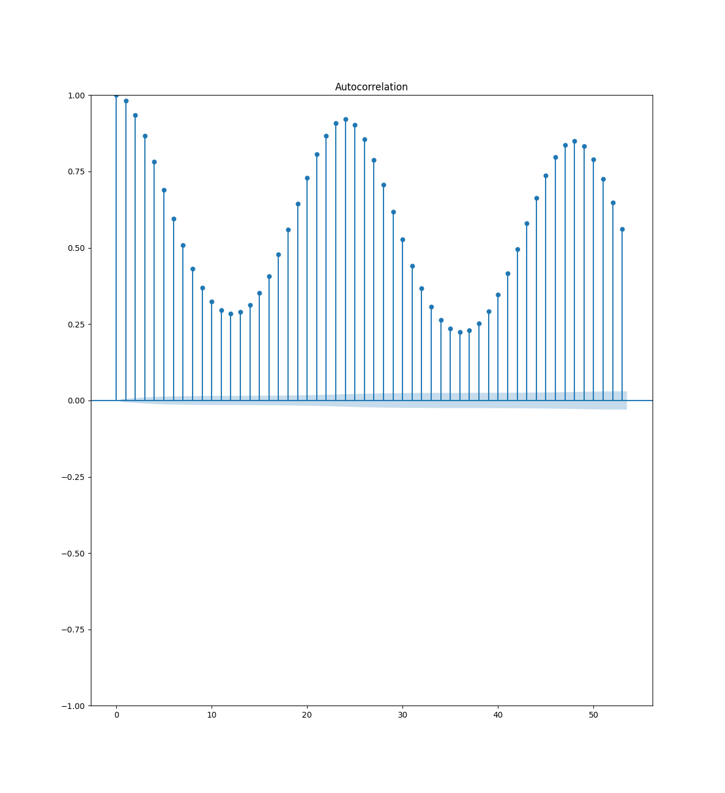
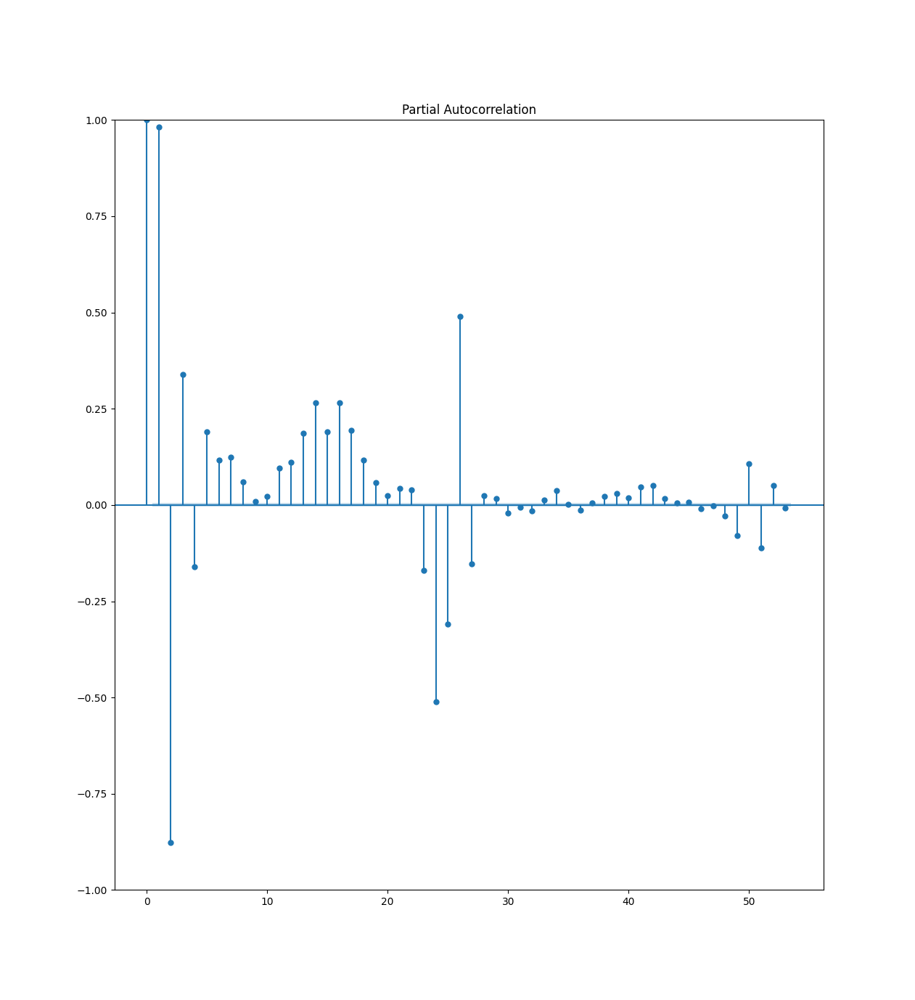
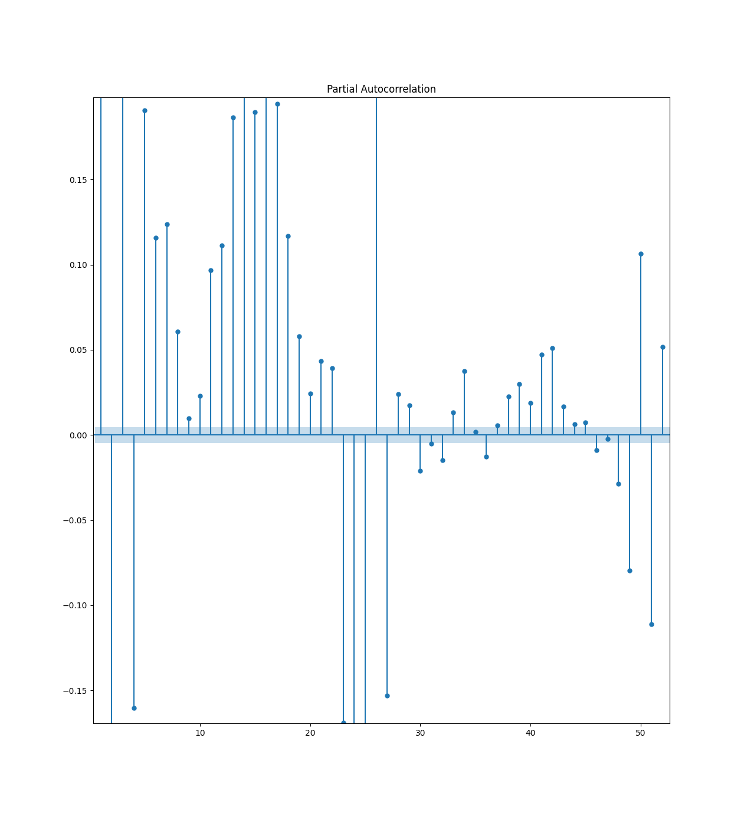

# Project Popsickle
Project popsickle aims to compare different time analysis techniques and assess their efficacy when forecasting power draw data. Multivariate techniques will be able to use weather in major cities as an extra predictor.

## Run
```
pip install -r requirements.txt
make insert
```

## Pipeline [^1]
There are two main datasets that this project uses: the power draw dataset and the weather dataset.

The power draw dataset is taken directly from ERCOT's website as Excel files. From there, it is read, concatenated, cleaned, and put into our intermediate data storage, a SQLit3 database.

The weather dataset is gathered from Open Metos's API[^4] using OpenWeatherMap's Geocoding API[^5]. From there, it undergoes a process similar to the power draw data, and is put into our intermediate data storage, a SQLit3 database.

## Testing
### Stationarity
Stationarity is important because other models (eg. Moving Average) rely on it. 

The 3 conditions for stationarity are:
 - $\mu$ is constant
 - $\sigma$ is constant
 - There is no seasonality

From a visual inspection, it seems that while $\mu$ and $\sigma$ are constant, the power data shows seasonality.

This is further supported by an autocorrelation plot where we see a high autocorrelation every 24 hours.

[^2]

[^2]

When we zoom in, we can see that only a few values are considered statistically insignificant (95% confidence interval).
[^2]

#### Augmented Dickey-Fuller Test (ADF)
```
ADF Statistic: -12.128231738929712
p-value: 1.7603320083622594e-22
```

Since p-value $\lt$ 0.05, there is reason to reject the null hypothesis, therefore, ercot data is stationary. This is slightly confusing because there appears to be a trend.[^3]

## Footnotes
[^1]: Learn more about our [Data Pipeline Structure](https://github.com/dssg/hitchhikers-guide/tree/master/sources/curriculum/0_before_you_start/pipelines-and-project-workflow)
[^2]: This was discovered in this notebook: [ARIMA Exploration](https://github.com/JeromeSiljanUTA/project-popsickle/blob/main/notebooks/2023-02-18-jds-arima-exploration.ipynb)
[^3]: This was discovered in this notebook: [Stationarity Testing](https://github.com/JeromeSiljanUTA/project-popsickle/blob/main/notebooks/2023-02-19-jds-stationarity-testing.ipynb)
[^4]: [Open Meteo API](https://open-meteo.com/en/docs/historical-weather-api#latitude=32.78&longitude=-96.81&start_date=2002-01-01&end_date=2022-12-31&hourly=temperature_2m)
[^5]: [OpenWeatherMap API](https://openweathermap.org/api/geocoding-api)
